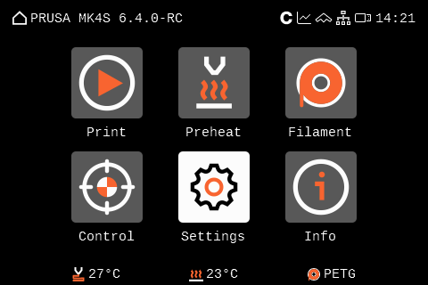
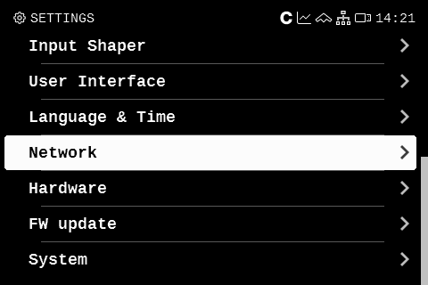
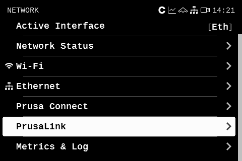
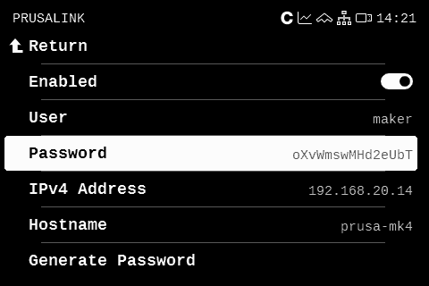

# Prusa Link Metrics and how to activate them

## Description

Prusa Link metrics are simply data taken from REST API that printer exposes. You can control printer from simple WUI or rather that like me, use it for digging some metrics. It uses Digest authentication so no puny basic auth as in Einsy Prusa Link. 

For prusa_exporter you need
- IP address
- username - mostly `default` maker but can be changed
- password
- printer model

### printer_model

At this moment it is not possible to get printer model from the printer directly and I need you, the user, to write it down by yourself.

List of printers
- MINI
- MK35
- MK35S
- MK39
- MK39S
- MK4
- MK4S
- Core One
- Core One L
- XL

For the function of the exporter it is not necessary to have printer_model filled but it's used in Grafana dashboards.

## Listing values

### Step 1. Open Settings

  

### Step 2. Open Network

  

### Step 3. Open PrusaLink

  

### Step 4. Fill the prusa.yml

  

```
  - address: IPv4 Address
    username: User
    password: Password
    name: <Chosen by user>
    type: <From the list above>
```


