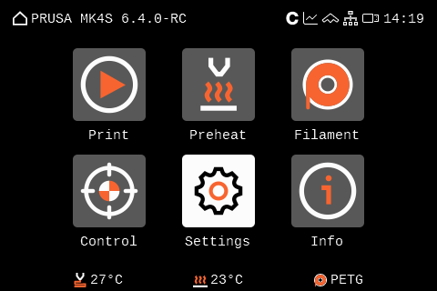
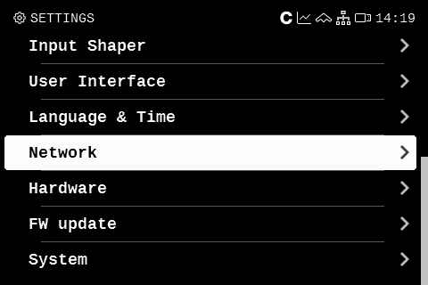
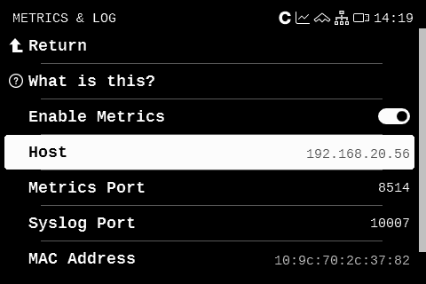
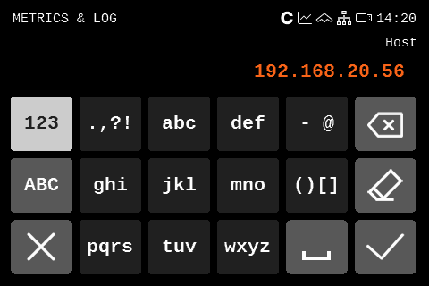
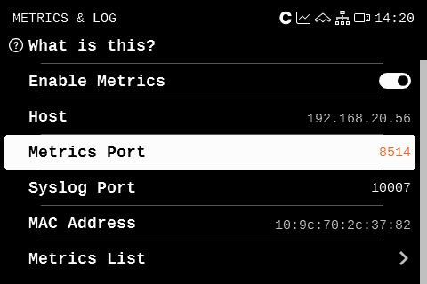
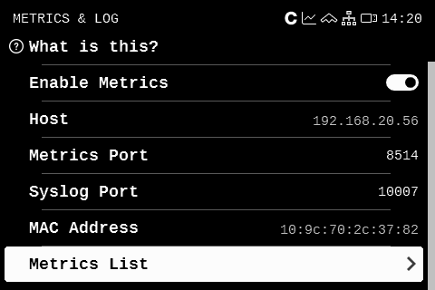
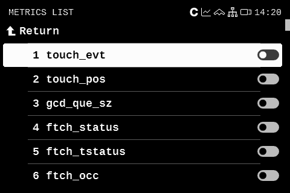
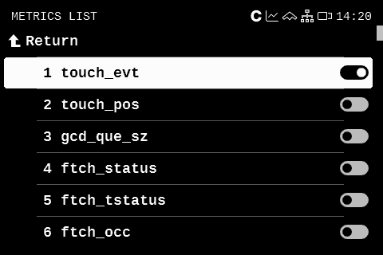

# UDP Metrics and how to activate them

## Description

Name **UDP metrics** is only my choice to name metrics that are emmited by Prusa Research pritners based on Buddy platform. Feel free to take a look to [Pursa-Firmware-Buddy](https://github.com/prusa3d/Prusa-Firmware-Buddy/blob/master/doc/metrics.md) repository. I don't necessary want to repeat what was once said. 

## Activation

Activation of metrics is pretty easy with prusa_exporter. That itself sends metrics.gcode to update metrics settings and user only has to "print" the `enable_udp_metrics.gcode`.

## Manual Activation

### Step 1. Open Settings

  

### Step 2. Open Network

  

### Step 3. Scroll down to Metrics & Log

  

### Step 4. Update Host and Port

### Step 5. Open Metrics List and enable or disable metrics

  
  
  
